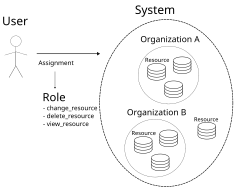

# Using DAB Role-Based Access Control

Access control allows or denies requests from a user based on some permission specification.
This system uses role definitions to organize and assign permissions efficiently.

## Terminology

For clarity, this documentation uses precise terminology:

- **Permission**: An action for a specific model type (e.g., "change inventory", "view project")
- **Role Definition**: A collection of permissions that can be assigned. In user-facing interfaces, these are often simply called "roles"
- **Role Assignment**: A record linking a user or team to a role definition, either for a specific object or globally
- **Content Type**: The model type that permissions apply to (e.g., Inventory, Project, Organization)

## Basic Concepts

### 1. Permissions

Permissions are the foundation of the access control system. Each permission combines:

 - The **action** being taken (view, change, delete, execute, etc.)
 - The **content type** the action applies to (inventory, project, organization, etc.)

For example, "change inventory" means the permission to modify inventory objects, but doesn't specify _which_ inventory until assigned.

### 2. Role Definitions

Role definitions group related permissions together for easy assignment. Each role definition contains:

 - A list of **permissions** granted to anyone assigned this role
 - A **content type** that determines what objects this role can be assigned to

Role definitions are templates - they become useful when assigned to users for specific objects.

## Permission Assignment Levels

The RBAC system allows assigning permissions at three different levels, each serving different use cases:

### 1. Object-Level Assignments

Give permissions to specific objects. When assigning a role definition to a user for an object, you specify:

 - The **role definition** (which permissions to grant)
 - The **user** receiving the permissions
 - The **object** the assignment applies to

This grants the user only the specified permissions for only that specific object.

### 2. Organization-Level Assignments

Organizations group objects together. When you assign a role definition to a user for an organization, they receive those permissions for **all** objects within that organization.

This is powerful for managing permissions at scale - one assignment can grant access to many related objects.

#### Resource Hierarchy

The organization concept is part of a broader resource hierarchy. Objects can have parent-child relationships, creating a tree structure where permissions granted at a parent level apply to all children.

### 3. System-Wide Assignments

System-wide role definitions have no content type restriction and provide **global** permissions. When assigned, users receive the listed permissions for **all** objects of the relevant types in the entire system.

System-wide assignments are powerful but require careful consideration to avoid confusing user experiences. For example, granting "change inventory" globally while not granting "view organization" could allow users to edit inventories in organizations they cannot see.

## Team-Based Permission Management

Teams provide a way to bulk-assign permissions to multiple users efficiently.

### Team Membership

Teams have a special **member** permission that acts as a multiplier. Users with team membership automatically inherit all permissions that have been assigned to the team.

### Direct Team Assignments

You can assign role definitions directly to teams. This grants the specified permissions to all team members.

### Combined Team and Organization Assignments

Teams can receive organization-level assignments, meaning a single role assignment can grant permissions to multiple objects for multiple users simultaneously.

### Nested Team Membership

Teams can be given member permission to other teams, creating nested hierarchies (if enabled by the application).
